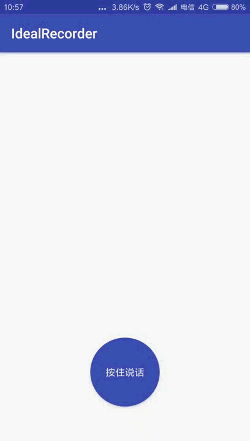

# IdealRecorder
an ideal WAV PCM recorder library for Android
## [README of English](https://github.com/ideastudios/IdealRecorder/blob/master/README_EN.md)

安卓上录制 WAV 或者PCM语音的库， 支持音量、录音数据、录音状态、文件路径回调


## 效果图


## 特点

- 可自定义录音参数（采样率、位数、单双通道、）
- 调用简单 调用start开始录音，调用stop停止录音
- 支持设置最大录制语音时长 到达最大时长则会自动停止
- 支持保存WAV文件 设置保存路径即可
- 可设置音量回调间隔时长 支持返回录音时的buffer数据
- 支持当没有录音权限回调


## 初始化

在Application或Activity的onCreate()方法中，传入context

```java
  IdealRecorder.getInstance().init(this);
```


## 使用

在控件的点击事件中进行配置

```java
        idealRecorder = IdealRecorder.getInstance();

    	idealRecorder.setRecordFilePath(getSaveFilePath());
    	//如果需要保存录音文件  设置好保存路径就会自动保存  也可以通过onRecordData 回调自己保存  不设置 不会保存录音

        idealRecorder.setRecordConfig(recordConfig).setMaxRecordTime(20000).setVolumeInterval(200);
         //设置录音配置 最长录音时长 以及音量回调的时间间隔

        idealRecorder.setStatusListener(statusListener);
         //设置录音时各种状态的监听

        idealRecorder.start();
        //开始录音
```

其中:

setRecordFilePath 为设置保存文件路径，正确设置后才会保存wav格式文件  文件路径请用绝对路径

recordConfig 为录音时的配置 请参考IdealRecorder.RecordConfig 类

statusListener为回调是的listener 重写需要用到的回调即可

具体使用请参考demo 代码


停止录音
```java

        idealRecorder.stop();
        //停止录音
```


## 注意事项

- 工程manifest已申明录音和写文件的权限，但安卓6.0后 仍然需要动态申请相关权限后使用
- 文件会保存为wav的格式，如果需保存其他格式，请自行在onRecordData 回调中自己保存即可
- 音量计算的方式为10 * Math.log10(mean); mean为buffer元素平方和除以数据总长度，也可在onRecordData中自行计算


## Gradle
[](https://www.jitpack.io/#ideastudios/IdealRecorder)
1. Add it in your root build.gradle at the end of repositories:
```
	allprojects {
		repositories {
			...
			maven { url 'https://jitpack.io' }
		}
	}
```

2. Add the dependency
```
	dependencies {
	        implementation'com.github.ideastudios:IdealRecorder:2.0.4'
	}


```


## 感谢

该工程demo 正弦波形图使用的是[Jay-Goo/WaveLineView](https://github.com/Jay-Goo/WaveLineView)
动态申请权限使用的是[yanzhenjie/AndPermission](https://github.com/yanzhenjie/AndPermission)

